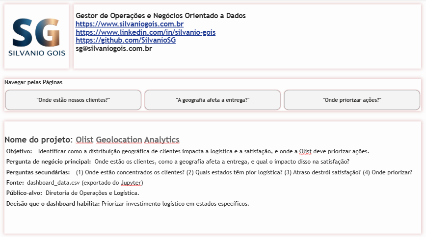
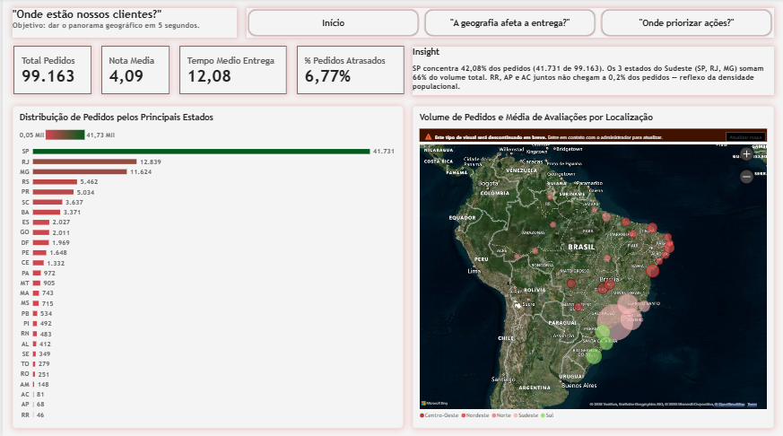
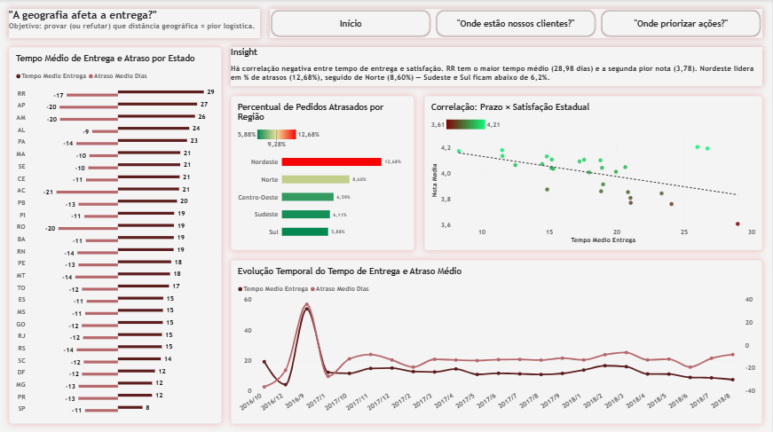
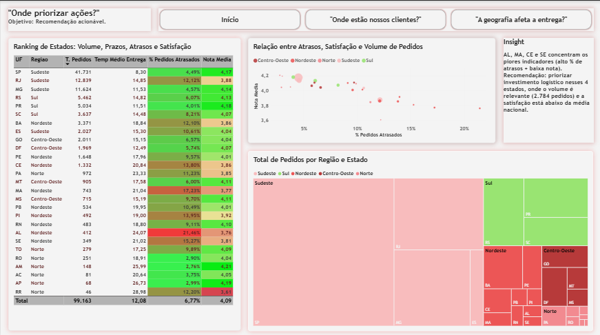

# Olist Geolocation Analytics

Projeto de análise de dados e Business Intelligence aplicado à base pública **Brazilian E-Commerce Public Dataset by Olist**, com o objetivo de responder a uma pergunta de negócio concreta sobre distribuição geográfica de clientes, desempenho logístico e satisfação, e entregar uma recomendação de priorização de investimento logístico.

---

## 1. Contexto e origem dos dados

Os dados utilizados neste projeto são provenientes do dataset público **Brazilian E-Commerce Public Dataset by Olist**, disponibilizado no Kaggle. O dataset reúne informações reais e anonimizadas de aproximadamente 100 mil pedidos realizados entre 2016 e 2018 em uma plataforma de e-commerce brasileira, contemplando dados de clientes, vendedores, pedidos, avaliações, produtos e geolocalização por CEP.

O intuito do projeto é aplicar, de ponta a ponta, técnicas de análise de dados e conceitos de Business Intelligence: desde o tratamento e enriquecimento dos dados brutos com Python, passando pela análise exploratória e geração de insights, até a construção de um dashboard executivo no Power BI com storytelling voltado para tomada de decisão.

---

## 2. Pergunta de negócio

**Pergunta principal**

> Onde estão os clientes, como a geografia afeta a entrega, e qual o impacto disso na satisfação?

**Perguntas secundárias**

1. Onde estão concentrados os clientes?
2. Quais estados apresentam pior desempenho logístico?
3. O atraso destrói a satisfação do cliente?
4. Onde a Olist deve priorizar ações de melhoria?

**Público-alvo:** Diretoria de Operações e Logística.

**Decisão habilitada pelo projeto:** priorizar investimento logístico em estados específicos, com base em evidência quantitativa.

---

## 3. Resposta de negócio

A análise confirmou a hipótese de que **a geografia impacta diretamente a logística e a satisfação**, e que o problema não é apenas a distância, mas a **previsibilidade do prazo de entrega**.

Os principais achados foram:

- **Concentração geográfica da demanda:** São Paulo concentra 42,08% dos pedidos (41.731 de 99.163). Sudeste, Sul e Nordeste juntos respondem por mais de 90% do volume.
- **Desigualdade logística:** o tempo médio de entrega varia de 8,30 dias (SP) a 28,98 dias (RR), uma diferença de aproximadamente 3,5 vezes entre o melhor e o pior estado.
- **Atrasos concentrados no Nordeste e Norte:** o Nordeste apresenta 12,68% de pedidos atrasados, contra 5,88% no Sul. Os estados AL, MA, CE e SE combinam alto índice de atraso com baixa nota média de avaliação.
- **Impacto do atraso na satisfação:** pedidos entregues dentro do prazo têm nota média próxima de 4,3, enquanto pedidos atrasados caem para aproximadamente 2,5. A correlação entre tempo de entrega e nota média é negativa e significativa.
- **Recomendação:** priorizar investimento logístico nos estados **AL, MA, CE e SE**, onde o volume é relevante e a satisfação está consistentemente abaixo da média nacional.

---

## 4. Metodologia técnica

O projeto foi conduzido em duas etapas encadeadas: tratamento e análise com Python, seguido de dashboard executivo no Power BI.

### 4.1 Tratamento e enriquecimento com Python

- `olist_customers_dataset.csv`
- `olist_geolocation_dataset.csv`
- `olist_orders_dataset.csv`
- `olist_order_reviews_dataset.csv`

Etapas realizadas no notebook `01_geolocation_analysis.ipynb`:

- Padronização de cidades (remoção de acentos, normalização de caixa).
- Agregação da base de geolocalização por CEP, reduzindo aproximadamente 1.000.000 de registros para 19.015 CEPs únicos, utilizando a média das coordenadas como centroide.
- Merge entre clientes, pedidos, avaliações e geolocalização.
- Conversão de tipos de data e cálculo de métricas de negócio derivadas:
  - `delivery_days` — tempo total entre compra e entrega.
  - `delay_days` — diferença entre a data efetiva de entrega e a data estimada.
  - `is_late` — indicador binário de atraso.
- Verificações defensivas: deduplicação de `order_id` na base de reviews para evitar multiplicação de linhas no merge, tratamento de erros de parsing e validação de integridade referencial.
- Análise exploratória com Plotly (mapas, boxplots, séries temporais, análise de correlação).
- Exportação do arquivo enriquecido `dashboard_data.csv` para consumo no Power BI.

### 4.2 Dashboard executivo no Power BI

Arquivo do relatório: `01_geolocation_analysis.pbix`
Exportação do relatório: `01_geolocation_analysis.pdf`

Modelagem e boas práticas adotadas:

- Modelo em **star schema**, com tabela fato `fPedidos` e dimensões `dCalendario` e `dEstado` (com mapeamento de regiões brasileiras).
- Medidas DAX para KPIs de volume, logística e satisfação: Total de Pedidos, Nota Média, Tempo Médio de Entrega, Atraso Médio, Percentual de Pedidos Atrasados, Gap de satisfação entre pedidos no prazo e atrasados.
- Categorização geográfica explícita das colunas (`País`, `Estado ou Província`, `Cidade`, `Latitude`, `Longitude`) para garantir leitura correta pelo Bing Maps.
- Formatação condicional em tabelas e mapas, com escala de cores consistente em todas as páginas.

### 4.3 Integração Python + Power BI

Visual gerado em Python (Matplotlib/Seaborn) incorporado como imagem no relatório, em função da limitação do Power BI Service em renderizar visuais Python publicados. A imagem foi produzida no Jupyter e integrada ao `.pbix`, preservando o valor analítico do código Python sem comprometer a publicação online.

---

## 5. Estrutura do dashboard

O relatório está organizado em quatro páginas, cada uma com objetivo claro e papel específico na narrativa.

### Página 0 — Início

Apresentação do projeto, pergunta de negócio, público-alvo e navegação entre as páginas.

### Página 1 — Onde estão nossos clientes?

Panorama geográfico da base, com KPIs consolidados, mapa de distribuição de pedidos por estado e ranking de volume por unidade federativa.

### Página 2 — A geografia afeta a entrega?

Análise do desempenho logístico por estado e região: tempo médio de entrega, atraso médio, percentual de pedidos atrasados, correlação entre prazo e satisfação e evolução temporal dos indicadores.

### Página 3 — Onde priorizar ações?

Ranking completo dos 27 estados cruzando volume, prazo, atraso e satisfação, com gráfico de dispersão para priorização e treemap por região. Fecha o case com a recomendação acionável.

---

## 6. Arquivos do repositório

**Arquivos originais utilizados:**
- `SG_Site.png`

Link para download dos arquivos usados:
https://www.kaggle.com/datasets/olistbr/brazilian-ecommerce
- `olist_customers_dataset.csv`
- `olist_geolocation_dataset.csv`
- `olist_orders_dataset.csv`
- `olist_order_reviews_dataset.csv`

**Arquivos gerados neste projeto:**

- `01_geolocation_analysis.ipynb` — notebook com ETL, análise exploratória e geração dos insights.
- `dashboard_data.csv` — base enriquecida exportada do Jupyter para o Power BI.
- `01_geolocation_analysis.pbix` — dashboard no Power BI Desktop.
- `01_geolocation_analysis.pdf` — exportação estática do relatório.
- `pagina0.png`, `pagina1.png`, `pagina2.png`, `pagina3.png` — capturas das páginas do dashboard.

---

## 7. Acesso ao dashboard publicado

O relatório está publicado no Power BI Service e pode ser acessado pelo link abaixo:

https://app.powerbi.com/view?r=eyJrIjoiNjhmOGZiYWYtMTg4OC00ODY5LTliNTMtZGRmMDFmNGVkMDI5IiwidCI6IjJlYmQyYzU0LWY1ZDMtNGVmYi05ZGE3LWU4Yzk0YmQyMWQzOSJ9

---

## 8. Competências demonstradas

- Tratamento de dados brutos com Pandas, incluindo manipulação de grandes volumes, agregação por chave geográfica e enriquecimento de bases.
- Construção de métricas de negócio a partir de dados transacionais, com foco em logística e satisfação.
- Análise exploratória com Plotly e Matplotlib, incluindo mapas, séries temporais e análise de correlação.
- Modelagem dimensional (star schema) no Power BI.
- Escrita de medidas DAX para KPIs de negócio.
- Integração entre Python e Power BI.
- Storytelling com dados: estruturação de uma narrativa analítica em três páginas encadeadas que levam da descrição à recomendação.
- Tradução de achados quantitativos em decisões acionáveis de priorização de investimento.

---

## 9. Autor

**Silvanio Gois — Gestor de Operações e Negócios Orientado a Dados**

- Site profissional: https://www.silvaniogois.com.br
- LinkedIn: https://www.linkedin.com/in/silvanio-gois/
- GitHub: https://github.com/SilvanioSG
